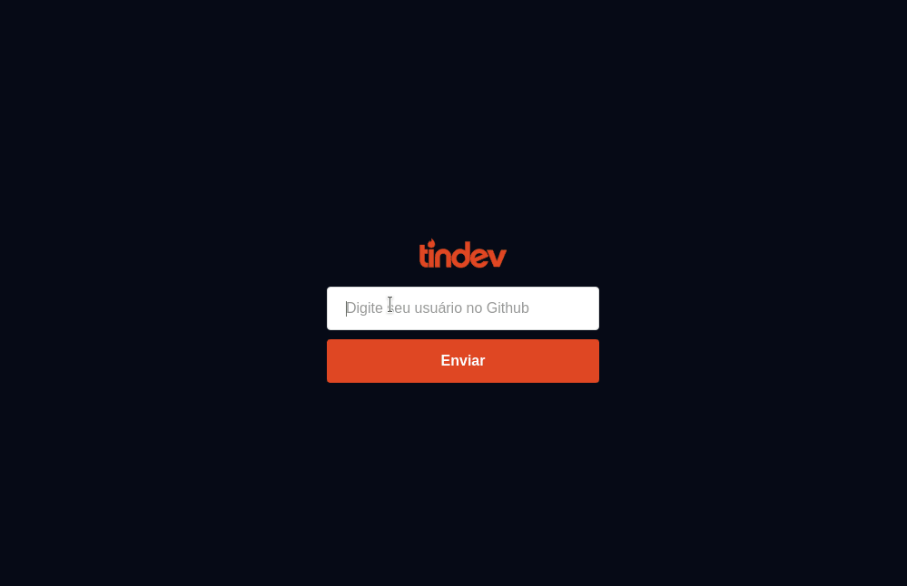
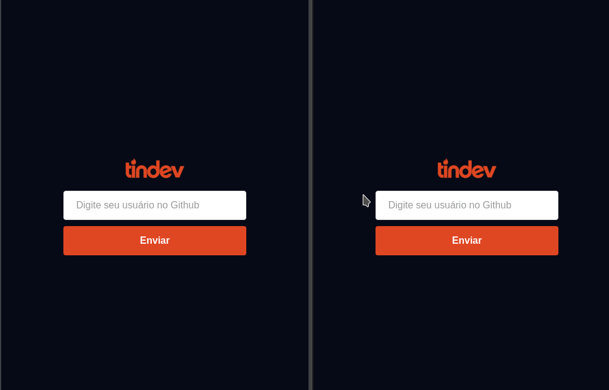

# Tindev

* Dark Mode

* Layout responsivo

## Projeto da Semana Omnistack #8

* Integração com API pública do GitHub
* Back-End em formato de API construído em NodeJS (Express) em banco de dados não relacional (MongoDB)
* Front-End construído em ReactJS

## Adições

* Versão da aplicação em Vue.js
* Layout responsivo
* Dark Mode
* Tratamento de excessões no backend
* Exibição de erros no frontend